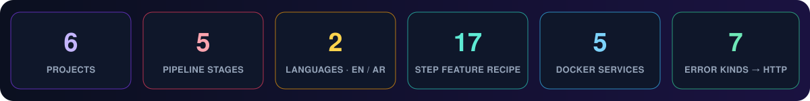
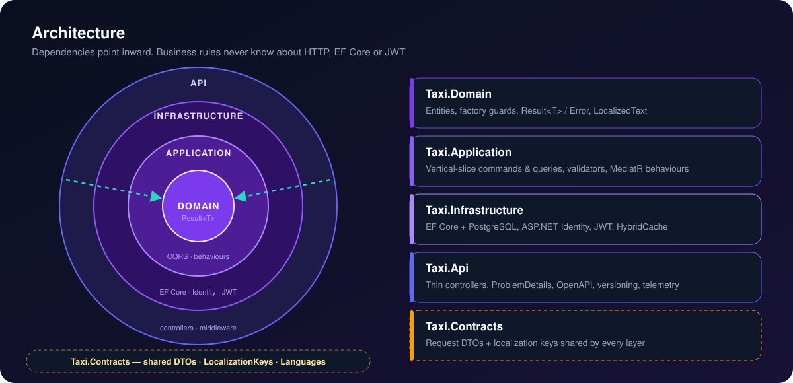
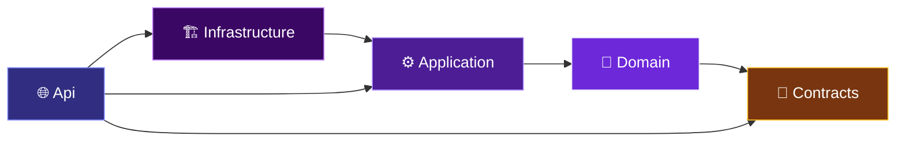
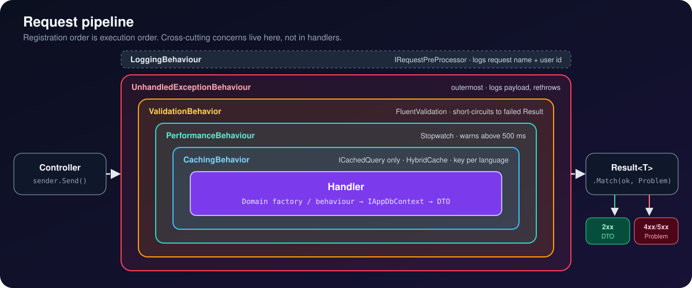
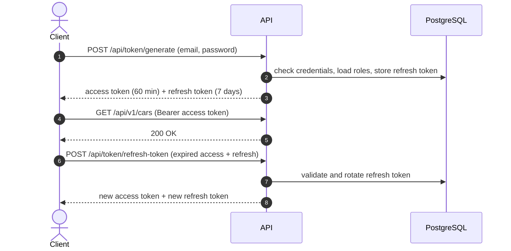
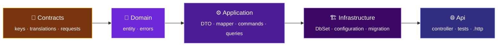

<!-- markdownlint-disable MD033 MD041 MD013 -->
<div align="center">



<br/>

[](https://github.com/fat7i-alghareeb/BackEnd_templete/actions/workflows/build-and-test.yml)


**A reusable .NET 10 backend template with Clean Architecture and CQRS,<br/>ready for new APIs with authentication, caching, logging and testing.**

[Quick start](#-quick-start) ·
[Features](#-features) ·
[Architecture](#-architecture) ·
[API](#-api-surface) ·
[Add a feature](#-adding-a-feature) ·
[Visual tour](docs/SHOWCASE.md)

</div>

> [!NOTE]
> **Not a taxi app.** `Taxi.*` is only the placeholder root namespace, and `Car` is the reference
> feature that shows the whole pattern end to end. Rename the namespace, replace `Car` with your
> own entities, and keep the plumbing.



## ✨ Features

| | Feature | What you get |
|:-:|:--|:--|
| 🧅 | **Clean Architecture** | Domain, Application, Infrastructure, Api and Contracts projects with dependencies pointing inward |
| ⚡ | **CQRS with MediatR** | One folder per use case, plus a pipeline for logging, validation, timing and caching |
| 🧾 | **Result pattern** | `Result<T>` instead of exceptions for business failures, mapped to RFC 7807 `ProblemDetails` in one place |
| 🔐 | **JWT + refresh tokens + RBAC** | HMAC-SHA256 access tokens, rotating refresh tokens (one live per user), role claims |
| 🌍 | **English / Arabic** | Localized error and validation messages, bilingual fields stored as JSONB, chosen by `Accept-Language` |
| 🐘 | **PostgreSQL + EF Core 10** | Migrations with retry, audit stamping, domain event dispatch |
| 🚀 | **HybridCache** | Opt-in query caching, split by language, cleared by tags |
| 📈 | **Observability** | Serilog, OpenTelemetry, Seq, Prometheus and Grafana, all started by Docker Compose |
| 🧪 | **Tests + CI** | xUnit suites, StyleCop on every build, GitHub Actions build and test |
| 📚 | **Docs + workflow** | Per-layer blueprints, REST naming rules, a 17-step feature recipe, AI prompt templates |

## 🧅 Architecture





| Project | Role |
|:--|:--|
| `Taxi.Domain` | Entities, invariants, `<Entity>Errors`, `Result<T>` / `Error`, `LocalizedText` |
| `Taxi.Contracts` | Request DTOs, `LocalizationKeys`, `Languages` |
| `Taxi.Application` | Commands, queries, handlers, validators, DTOs, MediatR behaviours |
| `Taxi.Infrastructure` | EF Core + PostgreSQL, ASP.NET Identity, JWT, HybridCache |
| `Taxi.Api` | Controllers, middleware, OpenAPI, composition root |
| `Taxi.Client` | Blazor WebAssembly shell (scaffold only, not hosted) |

### Request pipeline



Controllers stay thin: build the query or command, send it, match the result.

```csharp
[HttpGet("{id:guid}")]
public async Task<IActionResult> GetCar(Guid id, CancellationToken ct)
{
    var result = await sender.Send(new GetCarByIdQuery(id), ct);
    return result.Match(this.Ok, this.Problem);
}
```

## 🚀 Quick start

**You need:** [.NET 10 SDK](https://dotnet.microsoft.com/download) and [Docker Desktop](https://www.docker.com/products/docker-desktop/).

```bash
# 1. Clone
git clone https://github.com/fat7i-alghareeb/BackEnd_templete.git
cd BackEnd_templete

# 2. Start PostgreSQL, Seq, Prometheus and Grafana
docker compose up -d

# 3. Run the API (migrations and seed data are applied on startup)
dotnet run --project src/Taxi.Api
```

In Development, the API docs are served at:

| Tool | URL |
|:--|:--|
| 📘 OpenAPI document | `/openapi/v1.json` |
| 🧭 Swagger UI | `/swagger` |
| ✨ Scalar | `/scalar/v1` |

Sample calls are in [requests/requests.http](requests/requests.http). Sign in with the seeded
`admin@taxi.com` / `Admin123!` account (role `Manager`).

<details>
<summary><b>🔑 Secrets and configuration</b></summary>

<br/>

For local development nothing is needed: `appsettings.Development.json` already has a working
connection string and JWT secret.

Everywhere else, `ConnectionStrings:DefaultConnection` and `JwtSettings:Secret` are blank in
`appsettings.json` on purpose. Supply them with user secrets, environment variables or a `.env`
file (see [.env.example](.env.example)):

```bash
dotnet user-secrets set "ConnectionStrings:DefaultConnection" "Host=localhost;Port=5433;Database=TaxiDb;Username=postgres;Password=..." --project src/Taxi.Api
dotnet user-secrets set "JwtSettings:Secret" "<at least 32 characters>" --project src/Taxi.Api
```

| Setting | Default | Purpose |
|:--|:--|:--|
| `Database:ApplyMigrationsOnStartup` | `true` outside Production | apply migrations and seed on startup, with 5 retries |
| `Database:ResetOnStartup` | `false` | drop and recreate the database (Development only) |
| `JwtSettings:TokenExpirationInMinutes` | `60` | access token lifetime |

</details>

> [!CAUTION]
> The development JWT secret and the seeded admin password are public placeholders committed to
> this repository. Anyone reading the repo can forge tokens signed with that secret. Override
> `JwtSettings:Secret` and change the admin password before running anywhere other than your own
> machine.

## 🌐 API surface

| Method | Route | Auth | Description |
|:--|:--|:-:|:--|
|  | `/api/token/generate` | | Sign in, get access + refresh token |
|  | `/api/token/refresh-token` | | Swap an expired access token + refresh token for new ones |
|  | `/api/token/user-info` | 🔒 | Current user, roles and claims |
|  | `/api/v1/cars` | 🔒 | List cars (cached per language) |
|  | `/api/v1/cars/{id}` | 🔒 | One car (cached per language) |
|  | `/api/v1/cars` | 🔒 | Create a car |
|  | `/api/v1/cars/{id}` | 🔒 | Update a car |
|  | `/api/v1/cars/{id}` | 🔒 | Remove a car |

Errors always come back as `ProblemDetails`, translated by `Accept-Language`:

<table>
<tr><th width="50%"><code>Accept-Language: en</code></th><th width="50%"><code>Accept-Language: ar</code></th></tr>
<tr>
<td>

```json
{
  "title": "Car not found",
  "status": 404,
  "instance": "GET /api/v1/cars/3f2a…",
  "requestId": "0HN7…:00000001"
}
```

</td>
<td>

```json
{
  "title": "السيارة غير موجودة",
  "status": 404,
  "instance": "GET /api/v1/cars/3f2a…",
  "requestId": "0HN7…:00000001"
}
```

</td>
</tr>
</table>

| `ErrorKind` | `Validation` | `Unauthorized` | `Forbidden` | `NotFound` | `Conflict` | `Failure` / `Unexpected` |
|:--|:-:|:-:|:-:|:-:|:-:|:-:|
| **HTTP** | 400 | 401 | 403 | 404 | 409 | 500 |

## 🔐 Authentication



- **Access token:** JWT signed with HMAC-SHA256, carrying the user id and `role` claims.
- **Refresh token:** stored in the database, one live token per user, rotated on every refresh.
- **RBAC:** controllers use `[Authorize]`; roles from ASP.NET Identity are ready for `[Authorize(Roles = "...")]`.
- **Hardening:** CORS policy from config, forwarded-headers settings, and a sliding-window rate-limit policy ready to attach.

## 🌍 Localization

English and Arabic out of the box. Error codes and validation messages are `LocalizationKeys`
constants resolved at the API boundary against
[`SharedResource.en.json`](src/Taxi.Api/Resources/SharedResource.en.json) and
[`SharedResource.ar.json`](src/Taxi.Api/Resources/SharedResource.ar.json). Translatable entity
fields use the `LocalizedText` value type, stored as a single JSONB column and returned in the
language the client asks for.

## 📈 Observability

`docker compose up -d` brings the whole stack up:

| Service | Port | Role |
|:--|:--|:--|
| 🌐 Taxi.Api | `5001` | the API (when run through Compose) |
| 🐘 PostgreSQL 16 | `5433` | database |
| 📜 Seq | `8081` (UI) · `5341` (ingest) | logs and traces |
| 📈 Prometheus | `9090` | scrapes `/metrics` |
| 📊 Grafana | `3000` | dashboards over Prometheus |

Logs go through Serilog to the console, a rolling file and Seq. Traces and metrics come from
OpenTelemetry. `PerformanceBehaviour` logs a warning for any request slower than 500 ms.

## 🧩 Adding a feature

Every feature follows the same 17-step recipe in [AGENTS.md](AGENTS.md), copying the matching
`Car` file at each step:



```text
src/Taxi.Application/Features/Cars/
├── Commands/   CreateCar · UpdateCar · RemoveCar
├── Queries/    GetCarById · GetCars
├── Dtos/       CarDto
└── Mappers/    CarMapper
```

Working with an AI agent? Use the templates in [prompts/](prompts/README.md).

## 🧪 Build and test

```bash
dotnet build Taxi_Server.slnx -c Debug
dotnet test Taxi_Server.slnx
dotnet list package --vulnerable --include-transitive
```

| Suite | Covers |
|:--|:--|
| `Taxi.Domain.UnitTests` | `Car` and `RefreshToken` factory guards, `Result<T>` conversions |
| `Taxi.Application.UnitTests` | MediatR pipeline order, `Result<T>` cache serialization |

StyleCop runs as part of every build, and package versions are managed centrally in
`Directory.Packages.props`.

## 📚 Documentation

| Document | Read it when |
|:--|:--|
| 🎨 [docs/SHOWCASE.md](docs/SHOWCASE.md) | you want the visual tour of the whole template |
| 🧭 [docs/NAVIGATION.md](docs/NAVIGATION.md) | you don't know which file to open |
| 🤖 [AGENTS.md](AGENTS.md) | you are adding a feature: hard rules and the 17-step checklist |
| 🏛️ [docs/ARCHITECTURE.md](docs/ARCHITECTURE.md) | you want the layers, pipeline and request lifecycle |
| 📐 [docs/RESTful_Naming_Constitution.md](docs/RESTful_Naming_Constitution.md) | you are naming a route or picking a status code |
| 📘 `src/Taxi.<Layer>/<Layer>_Layer_Blueprint.md` | you need the deep reference for one layer |

## 🛠️ Tech stack

<p>


</p>

<div align="center">


<sub>Built by <a href="https://github.com/fat7i-alghareeb">Fathi Alghareeb</a> · .NET 10 · Clean Architecture · CQRS</sub>

</div>
