<!-- markdownlint-disable MD033 MD041 MD013 -->
<div align="center">


<br/>


<h3>Clone it. Rename it. Ship features on day one.</h3>

<p>
A reusable <b>.NET 10</b> backend template with <b>Clean Architecture</b> and <b>CQRS</b>, and the
production concerns already wired in: <b>authentication</b>, <b>caching</b>, <b>logging</b>,
<b>monitoring</b> and <b>testing</b>.
</p>

<a href="../README.md"><b>README</b></a> ·
<a href="ARCHITECTURE.md"><b>Architecture</b></a> ·
<a href="../AGENTS.md"><b>Feature recipe</b></a> ·
<a href="RESTful_Naming_Constitution.md"><b>REST rules</b></a> ·
<a href="https://github.com/fat7i-alghareeb/BackEnd_templete"><b>GitHub</b></a>

</div>

<br/>


> [!NOTE]
> **This is not a taxi app.** The projects use `Taxi.*` as a placeholder root namespace, and the
> `Car` entity is a small **reference feature** that shows the full pattern end to end. Rename the
> namespace, delete `Car` when you have your own feature, and the plumbing stays.

---

## Contents

|   |   |   |
|:--|:--|:--|
| [1 · At a glance](#1--at-a-glance) | [5 · Authentication & RBAC](#5--authentication--rbac) | [9 · Observability](#9--observability) |
| [2 · Architecture](#2--architecture) | [6 · English / Arabic](#6--english--arabic) | [10 · Feature workflow](#10--feature-workflow) |
| [3 · Request lifecycle](#3--request-lifecycle) | [7 · Caching](#7--caching) | [11 · Quality & CI](#11--quality--ci) |
| [4 · Result pattern & errors](#4--result-pattern--errors) | [8 · Persistence](#8--persistence) | [12 · The whole map](#12--the-whole-map) |


## 1 · At a glance

<table>
<tr>
<td width="33%" valign="top">

### 🧅 Clean Architecture

Six projects, dependencies pointing inward. The domain has no idea HTTP, EF Core or JWT exist.

</td>
<td width="33%" valign="top">

### ⚡ CQRS + vertical slices

One folder per use case: command or query, handler, validator. MediatR carries it through a
five-stage pipeline.

</td>
<td width="33%" valign="top">

### 🧾 Result pattern

Business failures are values, not exceptions. `Result<T>` turns into a 2xx or an RFC 7807
`ProblemDetails`, in one place.

</td>
</tr>
<tr>
<td valign="top">

### 🔐 JWT + refresh + RBAC

HMAC-SHA256 access tokens, rotating refresh tokens (one live per user, 7 days), and role claims
ready for `[Authorize]`.

</td>
<td valign="top">

### 🌍 English / العربية

Errors and validation messages are keys. Bilingual data is one JSONB column. `Accept-Language`
picks the language.

</td>
<td valign="top">

### 🚀 Cache + observability

HybridCache per query, split by language. Serilog, OpenTelemetry, Seq, Prometheus and Grafana
come up with one `docker compose`.

</td>
</tr>
<tr>
<td valign="top">

### 🐘 PostgreSQL + EF Core

Migrations, retry on startup, audit stamping, domain event dispatch, and JSONB for localized
fields.

</td>
<td valign="top">

### 🧪 Tests + analyzers

xUnit suites lock down domain guards and pipeline order. StyleCop runs on every build, and GitHub
Actions builds and tests every push.

</td>
<td valign="top">

### 📚 Docs + workflow

A doc map, per-layer blueprints, REST naming rules, a 17-step feature recipe, and prompt templates
for AI agents.

</td>
</tr>
</table>


## 2 · Architecture


### Project references, exactly as they are in the `.csproj` files

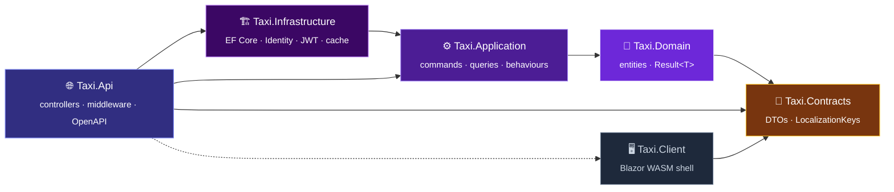

| Layer | Owns | Must never |
|:--|:--|:--|
| 💎 **Domain** | Entities (private ctor + `Create` factory), `<Entity>Errors`, `LocalizedText`, `Result<T>` | throw for a business rule, touch EF / ASP.NET |
| ⚙️ **Application** | Use-case folders, validators, DTOs, mappers, MediatR behaviours, interfaces | reference `HttpContext` or Infrastructure types |
| 🏗️ **Infrastructure** | `AppDbContext`, configurations, migrations, seeding, Identity, JWT, HybridCache | define business abstractions |
| 🌐 **Api** | Thin controllers, ProblemDetails, versioning, OpenAPI, rate limiting, telemetry | contain `try/catch`, business `if`s or data access |
| 📜 **Contracts** | Request DTOs with `DataAnnotations`, `LocalizationKeys`, `Languages` | reference Domain or Application |

> [!IMPORTANT]
> `Taxi.Domain → Taxi.Contracts` is intentional. Error codes are `LocalizationKeys` constants, and
> Contracts is the one project the Domain, the API and the Client can all see. The reasoning is in
> the [Domain blueprint](../src/Taxi.Domain/Domain_Layer_Blueprint.md).


## 3 · Request lifecycle


### One request, start to finish

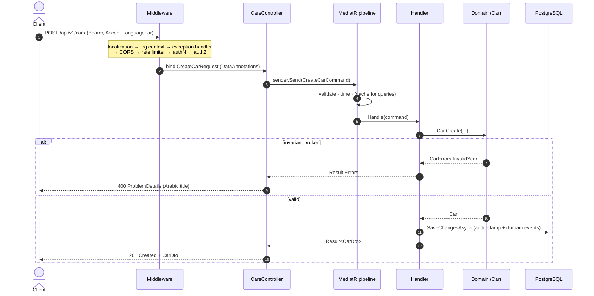

### Middleware order


> [!TIP]
> A controller action does three things: build the command, `await sender.Send(...)`,
> `return result.Match(ok, this.Problem)`. Anything more belongs in a handler or a behaviour.


## 4 · Result pattern & errors

```csharp
public static Result<Car> Create(Guid id, string make, string model, int year, string descriptionEn, string descriptionAr)
{
    if (year < 1886)
    {
        return CarErrors.InvalidYear;          // an Error converts to a failed Result<Car>
    }

    return new Car(id, make, model, year, new LocalizedText(descriptionEn, descriptionAr));
}
```

### `ErrorKind` → HTTP status

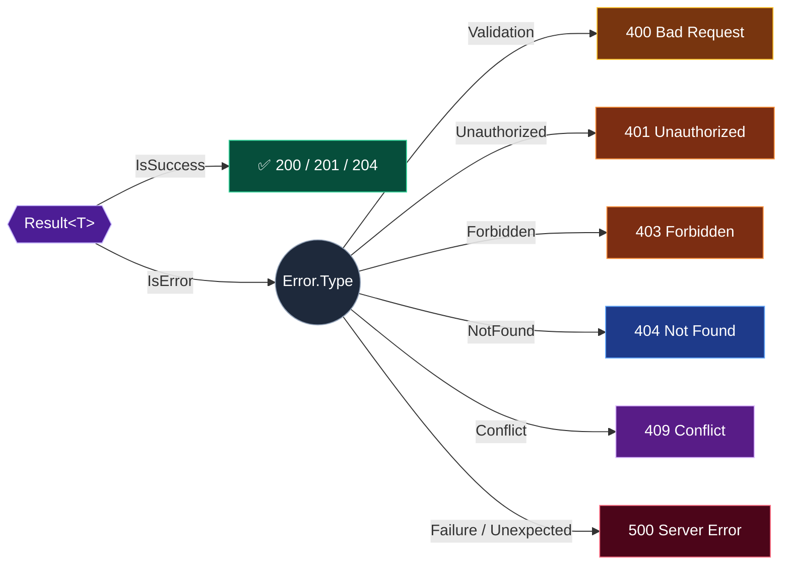

### Same error, two languages

<table>
<tr>
<th width="50%">🇬🇧 <code>Accept-Language: en</code></th>
<th width="50%">🇸🇦 <code>Accept-Language: ar</code></th>
</tr>
<tr>
<td valign="top">

```json
{
  "type": "https://tools.ietf.org/html/rfc9110#section-15.5.5",
  "title": "Car not found",
  "status": 404,
  "instance": "GET /api/v1/cars/3f2a…",
  "requestId": "0HN7…:00000001"
}
```

</td>
<td valign="top">

```json
{
  "type": "https://tools.ietf.org/html/rfc9110#section-15.5.5",
  "title": "السيارة غير موجودة",
  "status": 404,
  "instance": "GET /api/v1/cars/3f2a…",
  "requestId": "0HN7…:00000001"
}
```

</td>
</tr>
</table>

### Validation, in three tiers

| | Tier | Lives in | Catches | Fails as |
|:-:|:--|:--|:--|:--|
| 1️⃣ | **Contract** | `DataAnnotations` on request DTOs | shape: required, length, format | 400, before MediatR runs |
| 2️⃣ | **Application** | FluentValidation beside each use case | ranges, cross-field rules | 400 `ValidationProblemDetails`, per property |
| 3️⃣ | **Domain** | guards inside `Create` / behaviour methods | invariants, for every caller | `Result` failure with `<Entity>Errors` |


## 5 · Authentication & RBAC

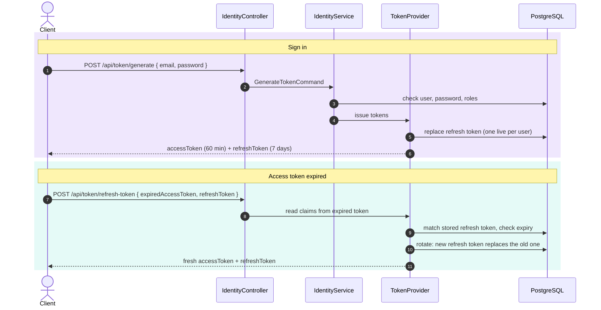

### Refresh token lifecycle

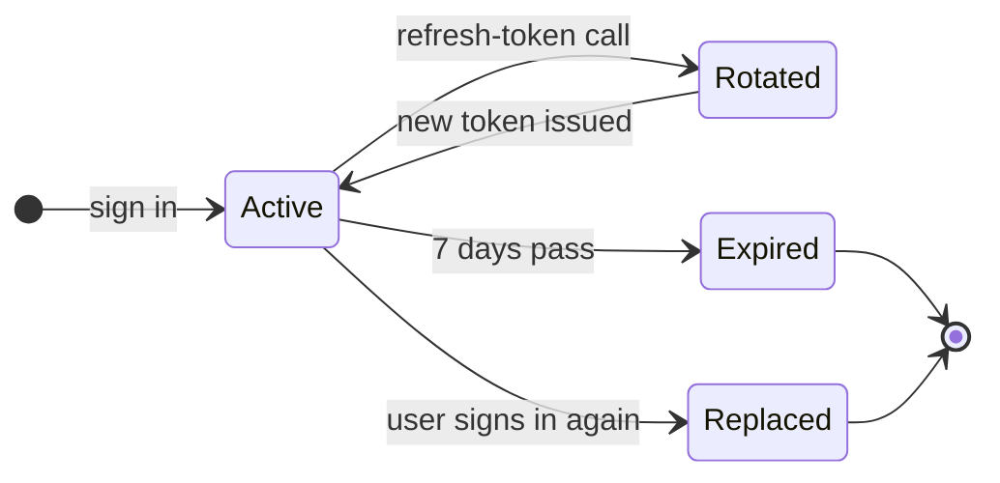

| 🔑 Piece | How it works |
|:--|:--|
| **Access token** | JWT, HMAC-SHA256, lifetime from `JwtSettings:TokenExpirationInMinutes` (60 by default) |
| **Refresh token** | stored in the database, **one live token per user**, 7-day expiry, rotated on every refresh |
| **Roles (RBAC)** | ASP.NET Identity roles are written into the JWT as `role` claims, ready for `[Authorize(Roles = "...")]` |
| **Current user** | `IUser` gives handlers the user id; the id never comes from a request body |
| **Seed** | first run creates the `Manager` role and `admin@taxi.com` / `Admin123!` |

> [!CAUTION]
> The development JWT secret and the seeded admin password are public placeholders. Replace
> `JwtSettings:Secret` and the admin password before running anywhere other than your own machine.


## 6 · English / Arabic

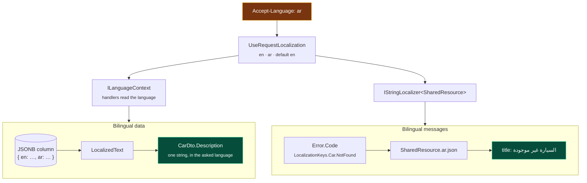

<table>
<tr><th>Key</th><th>🇬🇧 English</th><th>🇸🇦 العربية</th></tr>
<tr><td><code>Car.NotFound</code></td><td>Car not found</td><td dir="rtl">السيارة غير موجودة</td></tr>
<tr><td><code>Car.Year.Invalid</code></td><td>Car year is invalid</td><td dir="rtl">سنة السيارة غير صالحة</td></tr>
<tr><td><code>Auth.RefreshToken.Expired</code></td><td>Refresh token expired</td><td dir="rtl">انتهت صلاحية رمز التنشيط</td></tr>
<tr><td><code>Auth.User.NotFound</code></td><td>User not found</td><td dir="rtl">المستخدم غير موجود</td></tr>
</table>

> [!NOTE]
> There is no English prose in the failure path. Every message is a `LocalizationKeys` constant
> that must exist in **both** `SharedResource.en.json` and `SharedResource.ar.json`.


## 7 · Caching

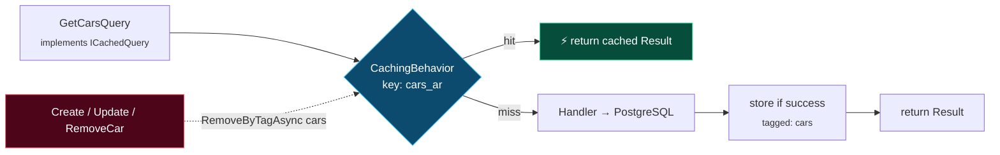

- **Opt-in per query** with `ICachedQuery<T>`: `CacheKey`, `Tags`, `Expiration`, `IsCultureAware`.
- **Split by language**: culture-aware keys become `{CacheKey}_{language}`, so Arabic and English never mix.
- **Only successes are cached.** Validation runs first, so bad input never reaches the cache.
- **Invalidation by tag**: every command that changes cached data calls `RemoveByTagAsync`.
- **HybridCache defaults**: 10-minute expiration, 30-second in-memory window.


## 8 · Persistence

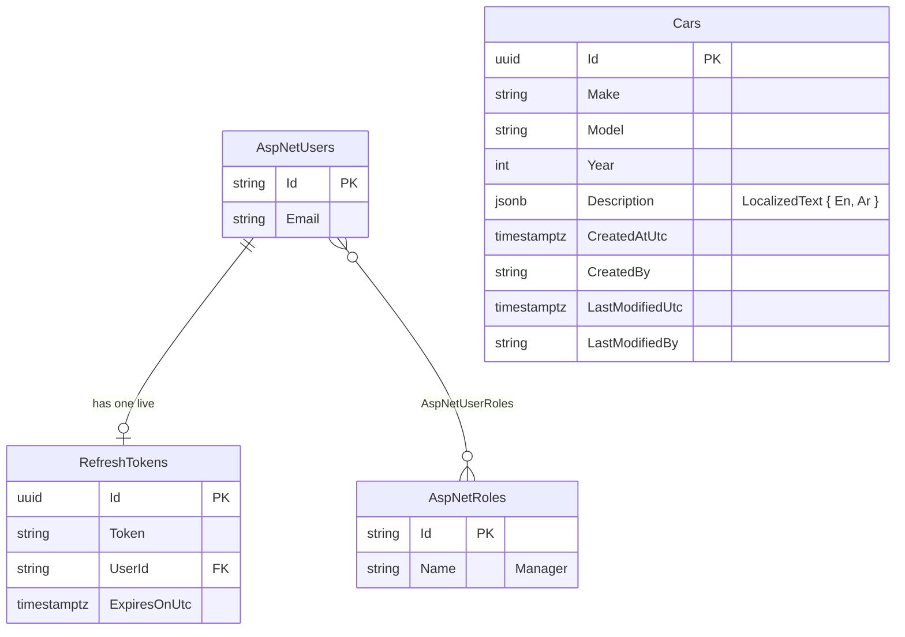

| ⚙️ Mechanism | What it does |
|:--|:--|
| `AppDbContext : IdentityDbContext<AppUser>` | Identity and business tables share one context and one transaction |
| `AuditableEntityInterceptor` | stamps `CreatedAtUtc`, `CreatedBy`, `LastModifiedUtc`, `LastModifiedBy` from `IUser` |
| `SaveChangesAsync` override | publishes domain events through MediatR before saving |
| `OwnsOne(...).ToJson()` | stores `LocalizedText` as one JSONB column |
| Startup migrations | applied with 5 retries in non-Production; switch with `Database:ApplyMigrationsOnStartup` |
| Npgsql resilience | retry on failure ×5, 60-second command timeout |


## 9 · Observability

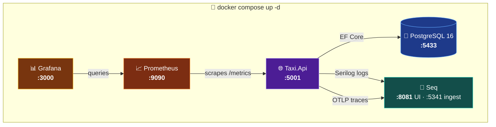

| Signal | Source | Destination |
|:--|:--|:--|
| 📜 **Logs** | Serilog, with request log context | Console · rolling file · Seq |
| 🧵 **Traces** | OpenTelemetry: ASP.NET Core + HttpClient | Seq over OTLP |
| 📈 **Metrics** | OpenTelemetry: ASP.NET Core + HttpClient | `/metrics` → Prometheus → Grafana |
| 🐢 **Slow requests** | `PerformanceBehaviour` | warning log above 500 ms |


## 10 · Feature workflow

Every new feature follows the same 17 steps, each one copying a real `Car` file. The full table
is in [AGENTS.md §3](../AGENTS.md).

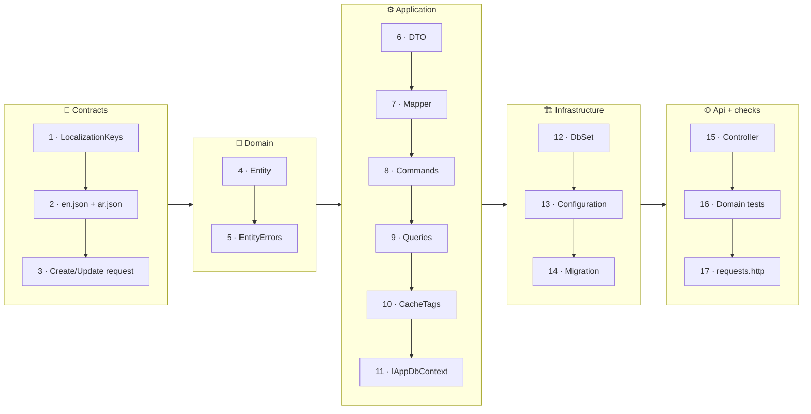

### What a feature looks like on disk

```text
src/Taxi.Application/Features/Cars/
├── Commands/
│   ├── CreateCar/   CreateCarCommand · CreateCarCommandHandler · CreateCarCommandValidator
│   ├── UpdateCar/   UpdateCarCommand · UpdateCarCommandHandler · UpdateCarCommandValidator
│   └── RemoveCar/   RemoveCarCommand · RemoveCarCommandHandler
├── Queries/
│   ├── GetCarById/  GetCarByIdQuery · GetCarByIdQueryHandler · GetCarByIdQueryValidator
│   └── GetCars/     GetCarsQuery · GetCarsQueryHandler
├── Dtos/            CarDto
└── Mappers/         CarMapper
```

### Prompt templates for AI agents

| Template | Use it when |
|:--|:--|
| 🆕 [add-feature.md](../prompts/add-feature.md) | a new entity, full slice from contract to controller |
| ✏️ [modify-feature.md](../prompts/modify-feature.md) | adding a field or changing a rule |
| 🎯 [single-layer-change.md](../prompts/single-layer-change.md) | work that stays inside one project |
| 🐛 [fix-bug.md](../prompts/fix-bug.md) | something is broken |
| 📝 [update-docs.md](../prompts/update-docs.md) | syncing the docs after a code change |


## 11 · Quality & CI

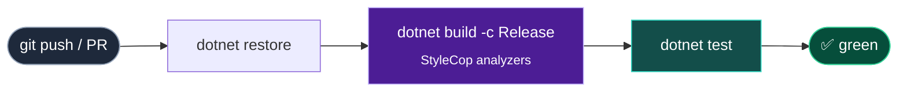

| Suite | Locks down |
|:--|:--|
| 🧪 `Taxi.Domain.UnitTests` | every `Car` and `RefreshToken` factory guard, `Result<T>` conversions |
| 🧪 `Taxi.Application.UnitTests` | MediatR pipeline order, `Result<T>` cache serialization round trip |

- **Central package management**: every version lives in `Directory.Packages.props`.
- **Shared build settings**: `net10.0`, nullable, implicit usings, StyleCop in `Directory.Build.props`.
- **Security check**: `dotnet list package --vulnerable --include-transitive`.


## 12 · The whole map

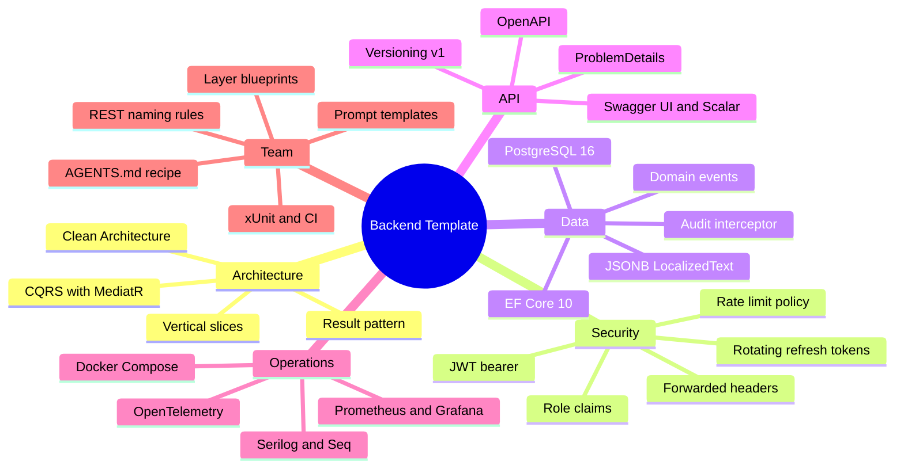

<br/>

<div align="center">


**Ready to build?** Start with the [README](../README.md), then open [AGENTS.md](../AGENTS.md).

<sub>Built by <a href="https://github.com/fat7i-alghareeb">Fathi Alghareeb</a> · .NET 10 · Clean Architecture · CQRS</sub>

</div>
